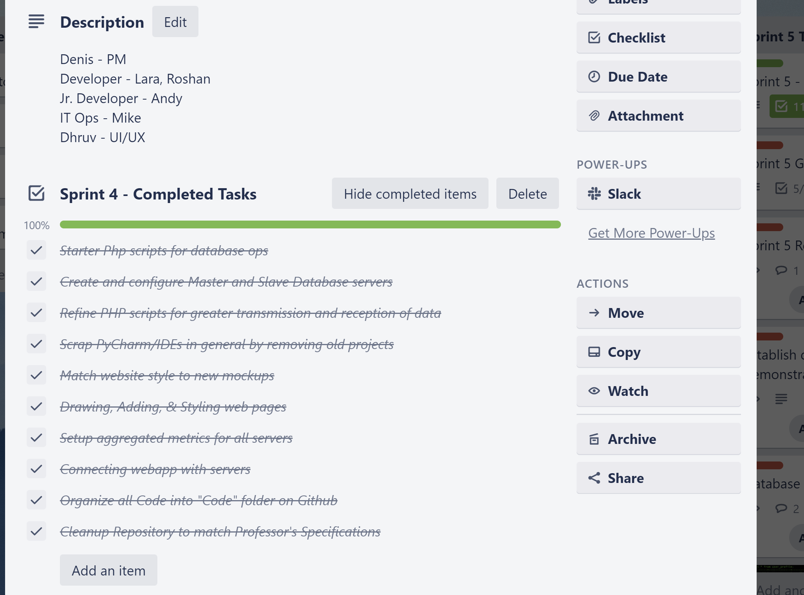
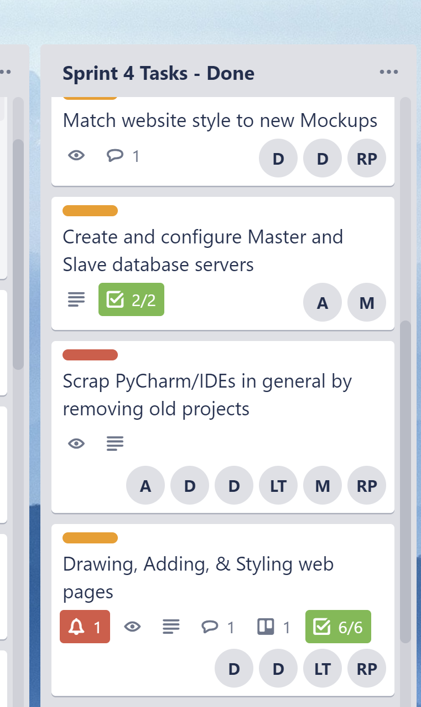
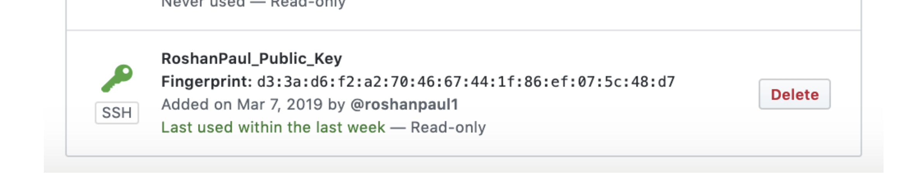
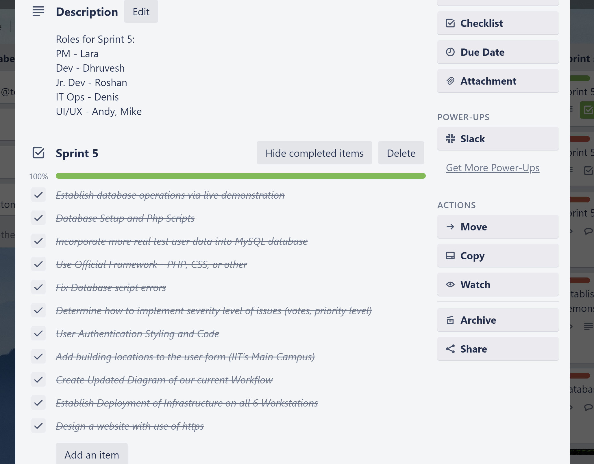
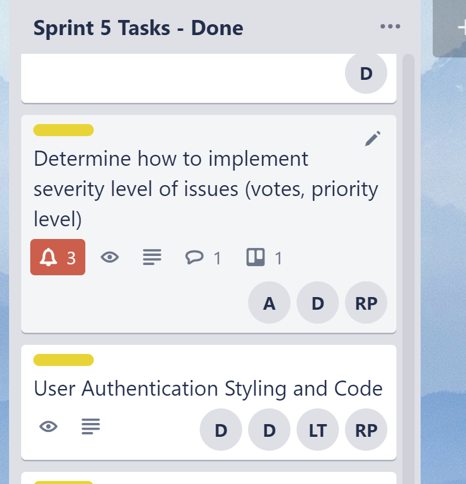
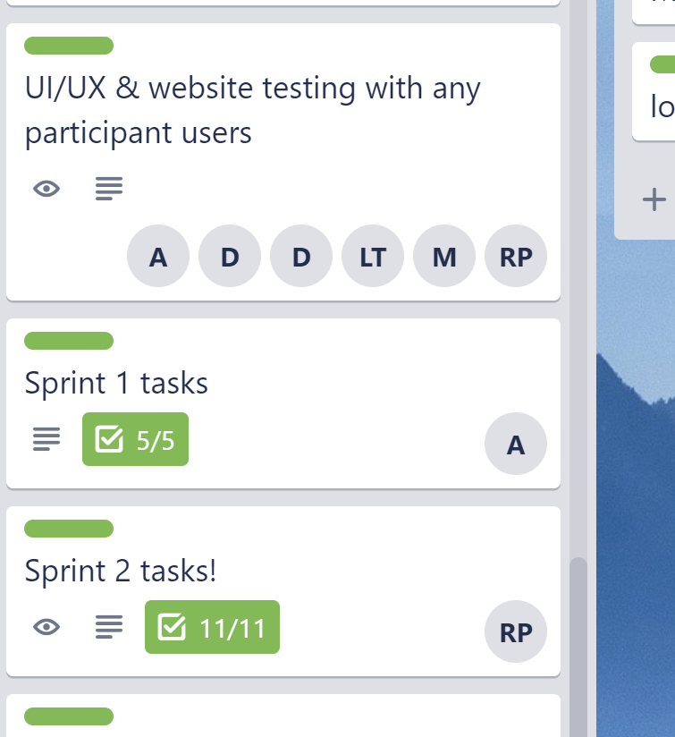
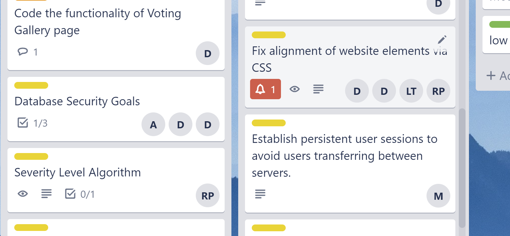
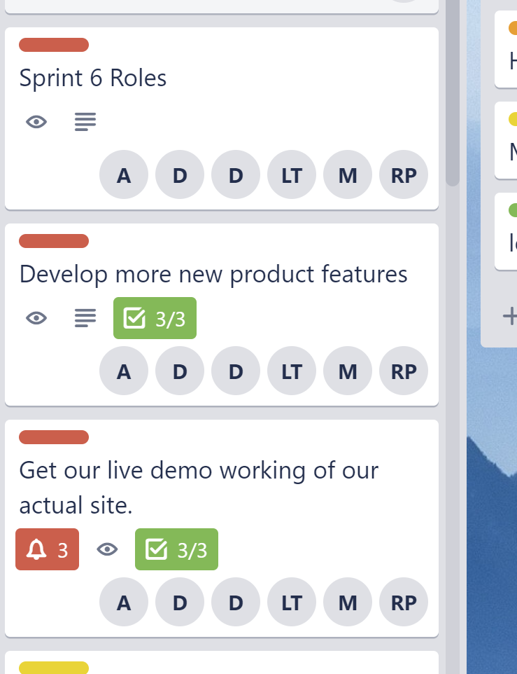

# Final Report

## ITMT 430 2019 - Roshan Paul

### Sprint 4

1. For this Sprint I was teamed up with Lara as the Developer.
1. I was responsible for drawing, adding and styling web pages.
1. Added building locations to the user form for IIT Main Campus.
1. Continued to work with visual studio code and developed our website.
1. Helped to get the live demo site working.
1. We were also responsible for deploying the infrastructure and code.
1. Attended team meetings whenever needed.
1. The following are the screenshots for Trello and Github commit history.

### Sprint 5

1. For this Sprint, I was the Junior Developer.
1. Worked on adding building locations to the user form, as it kept on giving errors.
1. Wrote scripts and made an algorithm for voting gallery page and saved it on google drive for future reference.
1. Collaborated to establish a fully functional website after class, to make it working.
1. Helped in Database setup and to fix database and script errors.
1. Determined on how to implement severity level of issues like priority levels for voting gallery.
1. Worked on user authentication, and styling the web pages.
1. Attended team meetings whenever needed.
1. The following are the screenshots for Trello and Github commit history.

### Sprint 6

1. For this Sprint I was the Developer and worked to make sure that we get our live demo working of our actual site.
1. Fixed alignment of the website elements via CSS.
1. Tested the website live with all other participant users.
1. Helped with coding the functionality of the voting gallery.
1. Teamed up with Dhruv to design and make a fully functional website.
1. Helped the project manager with the sprint reports.
1. Helped to create default images for the categories of maintenance issues.
1. Attended team meetings whenever needed.
1. The following are the screenshots for Trello and Github commit history.

